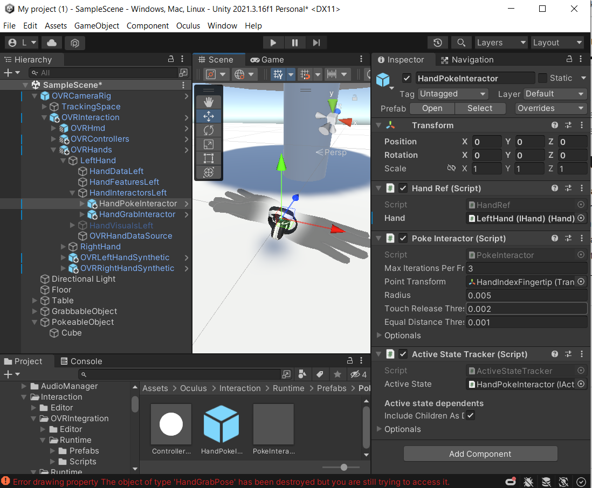

# Interaction SDK

This is a writeup of a few basic Interaction SDK features and how to implement them, to the best of my understanding. The information was collected from the [official documentation](https://developer.oculus.com/documentation/unity/unity-isdk-locomotion-interactions/) and from poking around in the example scenes that come with the Unity package.

## Types of Interaction

I'm going to be covering the grab, poke, and teleport interactions, which is not an exhaustive list, but it seems to me these are the more important ones.

### Grab

A 'grab' interaction is where the player picks up an object and it becomes attached to one of their hands.

Each object that can be picked up needs to have a HandGrabInteractable component attached to it (usually attached to one of the children), and a Rigidbody that will be attached to the object's root. There will also need to be a collider on one of the children (or on the root), that will tell the framework when the players hand is within grabbing distance.

You can specify hand 'poses' as well, which will determine where and how the players hand will attach to the object once it's been grabbed. A single object can have many such possible grab poses, but each one will need to have it's own HandGrabInteractable.

The hands that are doing the grabbing need to have a HandGrabInteractor component somewhere in their hierarchy. The SDK comes with some prefabs that can be dropped into the hand objects, that have all the tertiary components you might want to include. It's important that the Rigidbody property is set on the component, as that will be used for collision detection with the grabbable objects.

In addition to the HandGrab components, there are corresponding components for regular grabbing. This is similar, but only supports the use of controllers, while the HandGrabs ones support the use of hand tracking or controllers.

### Poke

A 'poke' interaction is where the player touches an object with their hands, such as when they are pushing a virtual button.

The distance between the players finger tip and a given pokeable object is measured perpendicular to a given plane. The plane is specified using a PlaneSurface component, which is part of the Oculus SDK. We must also specify a finite area within that plane, which represents the footprint of the button (or whatever type of element it is). If the player's finger gets close enough to the plane, whilst being in the confines of the footprint, then the element has been 'selected'.

As with the grab interaction, we need to attach a poke interactor to each hand in order to enable poking. The main thing with this component is to assign the Point Transform, which will denote the position of the players fingertip.

### Teleport

Teleporting is a simple way to get around in VR which reduces motion sickness when compared to the more conventional means of locomotion used in non-VR games.

To allow the player to teleport around on a surface, it needs to have one of the Oculus SDK 'Surface' components attached to it. In my case I went with a NavMeshSurface. Then you need to attach a TeleportInteractable component somewhere, and assign the previously created surface to the Surface property.

Each of the player's hands also needs a TeleportInteractor component. This will calculate an arc extending out from the player's hand, and if it collides with a teleportable surface, then the point of the collision will be where the player will teleport to, should they initiate a teleport. Teleport will be initiated based on the specified selector; in my example, it uses an IndexPinch selector, so the player must pinch together their thumb and index finger to teleport.